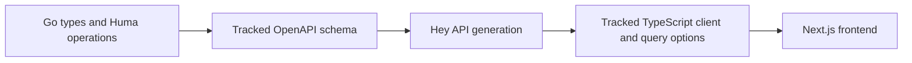
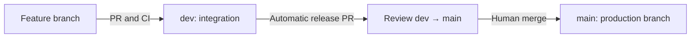

# Monorepo structure and CI/CD pipelines

This repository combines a Next.js frontend and a Go backend in one Nx workspace.
Go endpoint definitions generate the OpenAPI schema and TypeScript client used by
the frontend. GitHub Actions checks relevant projects and maintains a release PR.

**Current deployment status:** merging into `main` promotes code to the production
branch. No workflow deploys applications, publishes images, or performs rollbacks.
The repository currently provides CI and release PR automation, not production CD.

## Repository structure

```text
architect-monorepo/
├── apps/
│   ├── web/                         Next.js frontend; Nx project: web
│   │   ├── app/                     Pages, layout, styles, query provider
│   │   ├── next.config.ts           Backend proxy and client transpilation
│   │   ├── type-safety.ts           Compile-time contract examples
│   │   ├── project.json             Frontend Nx tasks
│   │   └── AGENTS.md / CLAUDE.md     Frontend agent guidance
│   └── backend/                     Go service; Nx project: backend
│       ├── cmd/backend/             HTTP entry point and schema export
│       ├── internal/api/            Huma operations, Go types, endpoint tests
│       ├── openapi.json             Generated, tracked API schema
│       ├── go.mod / go.sum          Go dependencies
│       ├── project.json             Backend Nx tasks
│       └── AGENTS.md / CLAUDE.md     Backend agent guidance
├── packages/
│   └── api-client/                  Nx project: api-client
│       ├── src/generated/           Hey API types, SDK, fetch client, query options
│       ├── project.json             Client generation task
│       └── AGENTS.md / CLAUDE.md     Generated-client guidance
├── tools/
│   ├── ci/
│   │   ├── plan.mjs                 Changed-path and comparison-base selection
│   │   ├── contract.mjs             Generated-file and schema verification
│   │   ├── release-pr.mjs           Release PR creation and updates
│   │   ├── *.test.mjs               CI and release automation tests
│   │   └── AGENTS.md / CLAUDE.md     CI guidance
│   ├── gofmt.mjs                    Go formatting helper
│   └── lint-staged-go.mjs           Staged Go lint filtering
├── .github/workflows/
│   ├── ci.yml                      Selective project checks
│   └── release-pr.yml              Automatic dev → main release PR
├── docs/
│   ├── frontend/                   Frontend development guide
│   ├── backend/                    Backend development guide
│   └── common/                     Shared development and pipeline guides
├── AGENTS.md / CLAUDE.md            Shared agent guidance and Claude import
├── openapi-ts.config.ts             Hey API generator configuration
├── nx.json                         Nx inputs, caching, and default base
├── package.json                    Workspace commands and pnpm version
├── pnpm-workspace.yaml             JavaScript workspace membership
├── pnpm-lock.yaml                  JavaScript dependency lockfile
└── lefthook.yml                    Staged-file pre-commit checks
```

pnpm manages JavaScript dependencies. Go manages its own module dependencies.
Nx coordinates tasks across both languages; it does not replace Go's toolchain.
The frontend directory is `apps/web`, and its Nx project name is `web`.

Each `CLAUDE.md` imports its sibling with `@AGENTS.md`. Shared rules live at the
root; scoped files cover project-specific work. Detailed explanations live in
`docs/`. See the [root instructions](../../AGENTS.md) for the scope map.

## API contract and runtime flow



The local Nx dependency chain is:

```text
backend:openapi → api-client:generate → web:dev / web:typecheck / web:build
```

`pnpm generate` exports the schema without starting an HTTP server, then generates
the client. Include generated changes with their source changes in the same PR.
Edit Go definitions or generator configuration rather than generated output.

At runtime, the browser uses generated TanStack Query options to request
`/api/greeting` from the frontend origin. Next.js proxies `/api/*` and `/schemas/*`
to the backend. `API_URL` defaults to `http://127.0.0.1:8080`; the Go listen address
uses `API_ADDR`, defaulting to `127.0.0.1:8080`. Production Next.js builds capture
the proxy destination, so changing it requires rebuilding.

### What contract checks prove

| Check                  | What it verifies                                     | What it does not guarantee                        |
| ---------------------- | ---------------------------------------------------- | ------------------------------------------------- |
| Contract verification  | Regeneration matches the committed schema and client | Compatibility with existing consumers             |
| Frontend type checking | Frontend code uses valid generated types             | Runtime response validation                       |
| Backend endpoint tests | Tested handler and validation behavior               | Every endpoint scenario or deployed compatibility |

Adding an unused response field can pass all checks. Renaming `message` to
`greetingText` while leaving `greeting.data.message` in the frontend makes frontend
type checking fail, even when contract verification passes. Independently deployed
frontend and backend versions still need a compatible rollout strategy.

## Branch and release flow



Create feature branches from `dev` and target their PRs at `dev`. Promote changes
through the release PR into `main`. Neither workflow automatically merges PRs.
Branch protection or rulesets must require `Workspace checks` to enforce passing
CI; defining a workflow alone does not prevent a merge.

## CI: selective workspace checks

Source: [ci.yml](../../.github/workflows/ci.yml).

| Event                            | Behavior                                            |
| -------------------------------- | --------------------------------------------------- |
| PR targeting `dev` or `main`     | Runs when opened, reopened, or updated with commits |
| Push to `dev` or `main`          | Runs after merges and direct pushes                 |
| Manual dispatch                  | Runs all checks                                     |
| Feature-branch push without a PR | Does not trigger this workflow                      |

The single job is named **Workspace checks**. It always runs automation tests and
change selection, including for documentation-only PRs. A newer run cancels an
older run for the same event and Git ref. PR and push runs use separate groups.

### Pipeline steps

1. Check out full Git history and set up Node.js.
2. Run the CI selection and release automation tests.
3. Select backend, frontend, and contract work using `tools/ci/plan.mjs`.
4. Install pnpm dependencies only when project checks or generation need them.
5. Set up Go and verify its dependencies only for backend or contract work.
6. When selected, regenerate OpenAPI and the client and reject uncommitted output changes.
7. Run selected backend checks.
8. Run frontend checks when frontend paths were selected or the schema changed.

Backend checks are golangci-lint, gofmt verification, Go tests, and the Go build.
Frontend checks are Oxlint, Oxfmt verification, TypeScript checking, and the Next.js
build. CI excludes Nx task dependencies for these checks because it already
controls generation explicitly; frontend-only changes therefore do not invoke Go.

### Changes and checks

This table assumes a reliable comparison base. Combined changes take the union
of the selected work. Automation tests run in every case.

| Changed files                                                       | Backend checks | Frontend checks       | Contract verification |
| ------------------------------------------------------------------- | -------------- | --------------------- | --------------------- |
| Backend implementation or Go dependencies; schema unchanged         | Run            | Skip                  | Run                   |
| Backend changes that alter OpenAPI                                  | Run            | Run                   | Run                   |
| Backend `_test.go` files or `.golangci.yml` only                    | Run            | Skip                  | Skip                  |
| Frontend source or configuration only                               | Skip           | Run                   | Skip                  |
| API client package or `openapi-ts.config.ts`                        | Skip           | Run                   | Run                   |
| `apps/backend/openapi.json` only                                    | Skip           | Run if schema changed | Run                   |
| Files under `docs/` or root `README.md` only                        | Skip           | Skip                  | Skip                  |
| Root `AGENTS.md` / `CLAUDE.md`, or app-root README/agent files only | Skip           | Skip                  | Skip                  |
| Go formatting or staged-lint helper only                            | Run            | Skip                  | Skip                  |
| Shared configuration, CI scripts/workflows, or unknown paths        | Run            | Run                   | Run                   |

Documentation exclusions are path-specific, not a blanket Markdown exemption.
For example, `packages/api-client/AGENTS.md` currently selects frontend and contract
checks; `tools/ci/AGENTS.md` selects all checks. The classifier in
[plan.mjs](../../tools/ci/plan.mjs) is authoritative.

### Comparison bases and conservative fallbacks

- PRs compare their target base SHA with the checked-out merge commit, covering the full PR.
- Pushes compare with the latest successful push CI ancestor on the same branch, searching up to 300 successful runs.
- Failed or cancelled push runs do not become the baseline, so their changes remain covered.
- Manual runs, force pushes, missing history, and API failures select all checks.
- Renames include old and new paths; deletions also count.
- Schema comparison ignores JSON object key order, but preserves array order and values.
- Missing or invalid baseline schemas select frontend checks. Invalid generated JSON fails verification.

The workflow uses Ubuntu 24.04, Node.js 24.19.0, Go 1.26.7, and the pnpm version
from `package.json`. It caches the pnpm store and Go dependencies/build cache.
Nx task outputs are not restored across CI runs. Its token has `contents: read`
and `actions: read`; the job does not push generated fixes.

## Release PR automation

Source: [release-pr.yml](../../.github/workflows/release-pr.yml).

After a PR merges into `dev`, the workflow creates a `dev` → `main` PR if none
exists, or updates the open one. Docs-only merges also trigger it. It also runs
after a same-repository `dev` → `main` release merges, and supports manual dispatch.
Closing a PR without merging skips the job. A direct push alone does not trigger it.

Example title:

```text
Release: dev -> main (16 September, 2026, 2 PRs)
```

The title uses the date of the update in `Asia/Kolkata` and the number of distinct
unreleased PRs. The description contains:

- An introduction explaining promotion to the production branch.
- A **Merged into dev since the last release** section.
- Linked PR titles, numbers, and authors.
- An automatic-update footer.

The count excludes direct commits and same-repository `main` → `dev` sync PRs.
Direct commits can still appear in the release diff. The script uses Git ancestry
and recorded release heads to exclude already released PRs, including prior squash
or rebase releases. Rewriting branch history can break these associations.

Updates are serialized. The script rereads branch tips, handles concurrent PR
creation, and skips creation when the branches have identical content or `dev`
is already contained in `main`. Manual edits to the release title or body are
replaced by the next update. API failures, duplicate open releases, oversized notes,
or repeated concurrent changes fail explicitly; rerun after resolving the cause.

The job runs Node tests and the release script without installing application
dependencies. It checks out trusted `dev` code and requests `contents: read` plus
`pull-requests: write`. Repository Actions settings must allow GitHub Actions to
create and approve PRs, although this workflow only creates and edits PRs.

The built-in token can require a repository writer to approve workflows triggered
by the generated PR. See the [release workflow guide](README.md#automatic-release-pr)
for token behavior and manual recovery. The regular push CI on `dev` runs separately;
release PR creation does not wait for that CI result.

## Local checks and troubleshooting

Run workspace commands from the repository root:

| Command          | Purpose                                               |
| ---------------- | ----------------------------------------------------- |
| `pnpm dev`       | Generate the client and start frontend and backend    |
| `pnpm generate`  | Regenerate the tracked API contract and client        |
| `pnpm typecheck` | Regenerate types and check frontend consumers         |
| `pnpm test:ci`   | Test selection and release automation                 |
| `pnpm check`     | Run the full local suite, regardless of changed paths |

Lefthook formats and re-stages matching frontend and Go files before linting them.
It does not run builds, endpoint tests, or TypeScript checks. Go lint still analyzes
the package before filtering findings to staged files. See the
[hook guide](README.md#pre-commit-hook) for details.

| Failure                                            | Next action                                                                                                               |
| -------------------------------------------------- | ------------------------------------------------------------------------------------------------------------------------- |
| Generated files are stale                          | Run `pnpm generate`, review the diff, and include it with the source change                                               |
| A generated response property no longer exists     | Update frontend consumers or restore the contract; rerun `pnpm typecheck`                                                 |
| More projects run than expected                    | Check the selected baseline and changed-path classification in the Actions log                                            |
| Release PR is missing or stale                     | Inspect the Release PR run, repository permissions, and branch differences; use manual dispatch after resolving the cause |
| Application did not deploy after merging to `main` | Expected today: production deployment has not been implemented                                                            |

Next.js reloads frontend edits during development. Go and client generation do not
watch continuously; regenerate after endpoint changes and restart the Go process.
For project-specific work, use the [frontend](../frontend/README.md) and
[backend](../backend/README.md) guides.
